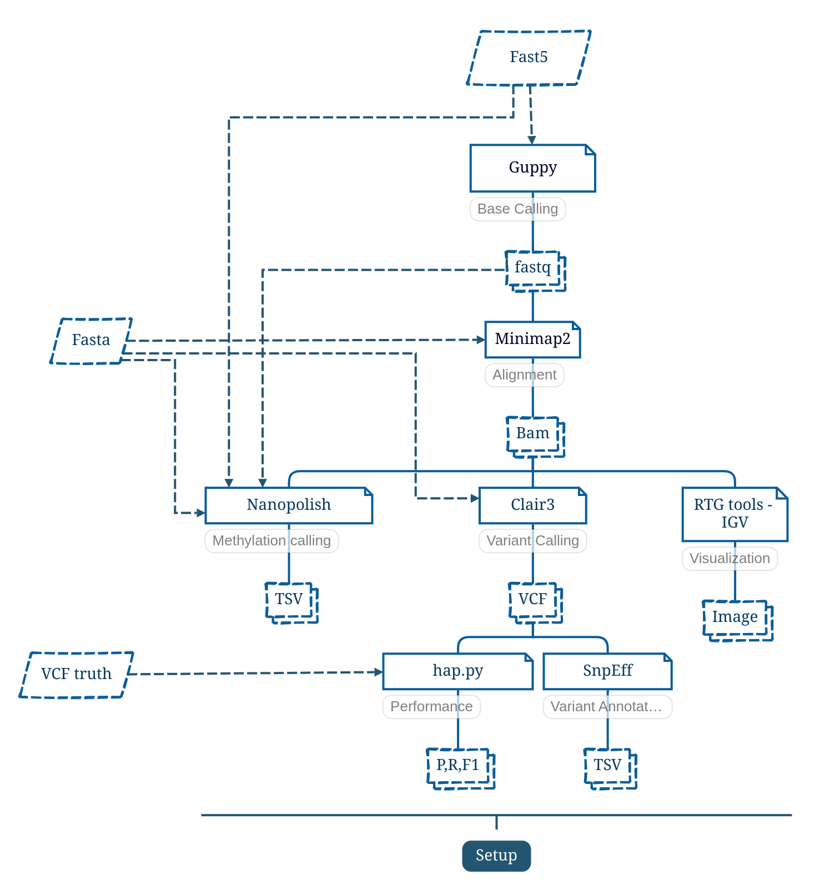
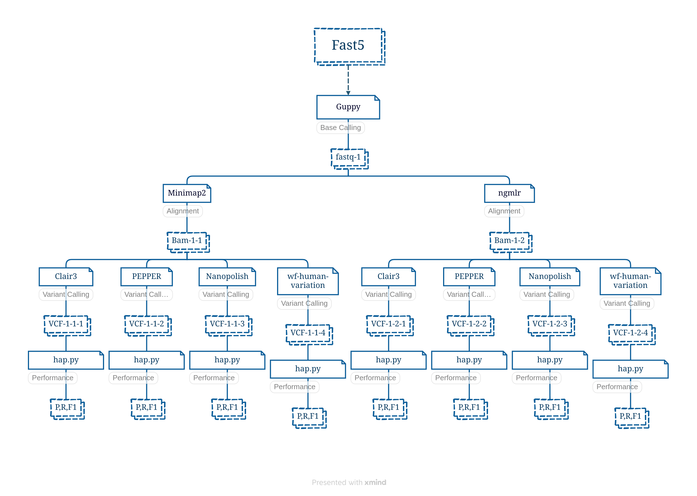

# PIPELINES PARA LLAMADO DE VARIANTES EN SECUENCIAS ONT

## 1. Main steps in bioinformatics pipeline for ONT sequences



## 2. Possible combinations of tools in the pipeline



## 3. Configuración previa del cluster

El cluster debe contar con los siguientes módulos:
- singularity
- nextflow
- guppy
- tensorflow

## 4. Configuración de los ambientes de conda
Se debe contar con los siguientes ambientes de conda:
- `conda env create -f conda-env-clair3.yml`
- `conda env create -f conda-env-happy.yml`
- `conda env create -f conda-env-nanopolish.yml`

## 5. Configuración inicial del repositorio

Crear las siguientes carpetas

```
git clone https://github.com/lhlopezm2/TGS-ORIGEN.git
cd TGS-ORIGEN
mkdir alignment
mkdir base-calling
mkdir methylation-calling
mkdir metrics
mkdir raw_reads
mkdir results
mkdir variant-calling
```

Dependiendo del pipeline que se vaya a ejecutar se deberá crear una carpeta correspondiente dentro de variant-calling y de metrics.

```
cd variant-calling
mkdir vcf-*-*-*
cd ..
cd metrics
mkdir metrics-*-*-*
cd ..
```

Se deben ubicar las lecturas fast5 en la carpeta raw_reads. Para las presentes pruebas preliminar con datos pequeños usaremos el archivo correspondiente al subset 4 de la secuenciación del individuo HG002, Ashkenazim Trio hijo y tiene un peso de aproximadamente 26 GB.

```
wget https://ftp-trace.ncbi.nlm.nih.gov/ReferenceSamples/giab/data/AshkenazimTrio/HG002_NA24385_son/Ultralong_OxfordNanopore/combined_2018-08-10/combined_2018-08-10.raw_fast5s.4.tar
```

Al descargar este archivo tenemos que descomprimirlo.
```
mkdir raw_reads
tar -xf combined_2018-08-10.raw_fast5s.4.tar -C raw_reads
```

Ahora bien necesitamos el genoma de referencia y el vcf benchmarking para calcular las metricas.

```
wget -O HG002_GRCh38_benchmark.vcf.gz https://ftp-trace.ncbi.nlm.nih.gov/giab/ftp/release/AshkenazimTrio/HG002_NA24385_son/latest/GRCh38/HG002_GRCh38_1_22_v4.2.1_benchmark.vcf.gz

wget -O HG002_GRCh38_benchmark.vcf.gz.tbi https://ftp-trace.ncbi.nlm.nih.gov/giab/ftp/release/AshkenazimTrio/HG002_NA24385_son/latest/GRCh38/HG002_GRCh38_1_22_v4.2.1_benchmark.vcf.gz.tbi

wget -O GRCh38.bed https://ftp-trace.ncbi.nlm.nih.gov/giab/ftp/release/AshkenazimTrio/HG002_NA24385_son/latest/GRCh38/HG002_GRCh38_1_22_v4.2.1_benchmark_noinconsistent.bed
```

Para utilizar PEPPER-MARGIN-DEEPVARIANT se debe descargar la imagen de singularity.

```
singularity pull docker://kishwars/pepper_deepvariant:r0.8
```

Para utilizar wf-human-variation se debe clonar el correspondiente repositorio
```
git clone https://github.com/epi2me-labs/wf-human-variation.git
```

Ahora bien, si los modulos y ambientes de conda coinciden con los nombrados al interior de los pipelines, se puede proceder a correr cualquiera de ellos usando slurm.

```
sbatch setup-*-*-*.sh
```

## 6. Explicación de los principales parámetros en las diferentas herramientas bioinformáticas

### 6.1 Base calling Tools

#### 6.1.1 Guppy
```
guppy_basecaller --disable_pings\
    -i ./raw_reads\
    -s "base-calling/fastq${fastq_v}"\
    --cpu_threads_per_caller 4\
    --flowcell FLO-PRO002M\
    --kit SQK-RBK112-96\
    --recursive -x 'cuda:all:50G'\
    --num_callers 5\
    --compress_fastq\
    --gpu_runners_per_device 15
```
| Parameter | Description |
| ----------- | ----------- |
| -i [ --input_path ]           | Path to input files|
| --kit                         | Kit to find a configuration for|
| --disable_pings               | Disable the transmission of telemetry pings.|
| -s [ --save_path ]            | Path to save output files.|
| --print_workflows             | Output available workflows.|
| --flowcell                    | Flowcell to find a configuration for.|
| -x [ --device ]               | Specify GPU device: 'auto', or 'cuda:<device_id>'.|
| --num_callers                 | Number of parallel basecallers to create.|
| --min_qscore                  | Minimum acceptable qscore for a read to be filtered into the PASS folder.|
| --gpu_runners_per_device      | Number of runners per GPU device.|
| --disable_qscore_filtering    | Disable filtering of reads into PASS/FAIL folders based on min qscore.|
| --cpu_threads_per_caller      | Number of CPU worker threads per basecaller.|
| --compress_fastq              | Compress fastq output files with gzip.|
| --gpu_runners_per_device        | Number of runners per GPU device.|


- El producto entre cpu_threads_per_caller y num_callers no debe superar el número de cores que se asignaron al trabajo, que en este caso fueron 20.
- La cantidad de runners per device debe ser seleccionada cuidadosamente con base en las características de cómputo. Para utilizar la cantidad óptima podría primero utilizarse un número grande (>50) y con base en los logs del error se selecciona este valor.
- Los parámetros flowcell y kit dependen de la configuración experimental usada para generar las lecturas.
- La opción recursive indica que hay archivos fast5 contenidos dentro de subcarpetas.
- Al finalizar la ejecución de guppy se crean 3 carpetas: fail, pass y guppy_basecaller-core-dump-db. La clasificacion entre fail y pass depende de si las lecturas superaron el umbral de calidad especificado por el parámetro min_qscore que por defecto tiene un valor de 7.
- La cantidad de memoria RAM debe ser especificada en la opción -x. De otro modo, es muy probable que lance un error.
- Los "telemetry pings" son pequeños paquetes de datos que se envían desde una aplicación de software a un servidor remoto. Estos pings a menudo contienen información sobre cómo se está usando el software, métricas de rendimiento, informes de errores y otros datos relevantes. El propósito de la telemetría es brindar a los desarrolladores información sobre cómo su software está funcionando en el mundo real, lo que puede ayudarles a identificar y solucionar problemas, mejorar la experiencia del usuario y tomar decisiones informadas sobre el desarrollo futuro.
- Flowcell es el componente físico en el que ocurre la secuenciación real a través de nanoporos.
- kit es el conjunto de reactivos y materiales necesarios para preparar las muestras y realizar el proceso de secuenciación en una plataforma de ONT.
- Más información puede ser encontrada en https://denbi-nanopore-training-course.readthedocs.io/en/latest/basecalling/basecalling_1.html o en https://nanoporetech.com/

### 6.2 Alignment Tools

#### 6.2.1 minimap2
```
minimap2 -a -z 600,200 -x map-ont $ref_fasta $fastq -t $CPU | samtools view -Shu |samtools sort -@ $CPU -o $bam --output-fmt BAM
```
| Parameter | Description |
| ----------- | ----------- |
|-z INT[,INT] |Truncate an alignment if the running alignment score drops too quickly along the diagonal of the DP matrix (diagonal X-drop, or Z-drop) [400,200]. If the drop of score is above INT2, minimap2 will reverse complement the query in the related region and align again to test small inversions. Minimap2 truncates alignment if there is an inversion or the drop of score is greater than INT1. Decrease INT2 to find small inversions at the cost of performance and false positives. Increase INT1 to improves the contiguity of alignment at the cost of poor alignment in the middle.|
|-a           |Generate CIGAR and output alignments in the SAM format. Minimap2 outputs in PAF by default.|
|-t INT       |number of threads|
|-x STR       |map-ont - PAlign noisy long reads of ~10% error rate to a reference genome. This is the default mode.|
|-o FILE      |output alignments to FILE [stdout]|

- La opción -a indica que se realizará un alineamiento.
- La opción -z 600,200 indica que si la caída del alignment score supera los 200,
minimap2 complementará de forma inversa la query en la región relacionada y se
alineará de nuevo para probar pequeñas inversiones. Minimap2 trunca la alineación
si hay una inversión o la caída del alignment score es mayor que 600.
- samtools view -Shu se utiliza para convertir un archivo de formato SAM en un
archivo de formato BAM.
- Para mayor información sobre minimap2 se puede consultar el siguiente enlace https://lh3.github.io/minimap2/minimap2.html
#### 6.2.2 ngmlr
```
ngmlr -t $CPU -r $ref_fasta -q $fastq -x ont | samtools view -Shu |samtools sort -@ $CPU -o $bam --output-fmt BAM
```
| Parameter | Description |
| ----------- | ----------- |
|-r <file>,  --reference <file> |(required)  Path to the reference genome (FASTA/Q, can be gzipped)|
|-q <file>,  --query <file> |Path to the read file (FASTA/Q) [/dev/stdin]|
|-o <string>,  --output <string> |Adds RG:Z:<string> to all alignments in SAM/BAM [none]|
|-t <int>,  --threads <int> |Number of threads [1]|
|-x <pacbio, ont>,  --presets <pacbio, ont> |Parameter presets for different sequencing technologies [pacbio]|
- Para mayor información sobre ngmlr se puede consultar el siguiente enlace https://github.com/philres/ngmlr
### 6.3 Variant Calling Tools
#### 6.3.1 Clair3

```
run_clair3.sh \
    --bam_fn=$bam \
    --ref_fn=$ref_fasta \
    --threads=$CPU \
    --platform="ont" \
    --model_path="${CONDA_PREFIX}/bin/models/${MODEL_NAME}" \
    --output=$vcf_folder
```
| Parameter | Description |
| ------------------------- | ----------- |
|-b, --bam_fn=FILE             | BAM file input. The input file must be samtools indexed.|
|-f, --ref_fn=FILE             | FASTA reference file input. The input file must be samtools indexed.|
|-m, --model_path=STR          | The folder path containing a Clair3 model (requiring six files in the folder, including pileup.data-00000-of-00002, pileup.data-00001-of-00002 pileup.index, full_alignment.data-00000-of-00002, full_alignment.data-00001-of-00002 and full_alignment.index).|
|-t, --threads=INT             | Max #threads to be used. The full genome will be divided into small chunks for parallel processing. Each chunk will use 4 threads. The #chunks being processed simultaneously is ceil(#threads/4)*3. 3 is the overloading factor.|
|-p, --platform=STR            | Select the sequencing platform of the input. Possible options: {ont,hifi,ilmn}.|
|-o, --output=PATH             | VCF/GVCF output directory.|
|--bed_fn=FILE            | Call variants only in the provided bed regions.|

- El modelo usado en este paso es “r941_prom_hac_g360+g422”, el cual fue entrenado usando la plataforma ONT r9.4.1 y sobre las muestras HG001,2,3,5.
- Los modelos disponibles son:
  - hifi
  - hifi_revio
  - hifi_sequel2
  - ilmn
  - ont
  - ont_guppy5
  - r941_prom_hac_g238
  - r941_prom_hac_g360+g422_1235
  - r941_prom_hac_g360+g422
  - r941_prom_sup_g5014
- Más información puede ser consultada en https://github.com/HKU-BAL/Clair3.
#### 6.3.2 PEPPER-MARGIN-DEEPVARIANT
```
singularity exec --bind /usr/lib/locale/ \
    pepper_deepvariant_r0.8.sif \
    run_pepper_margin_deepvariant call_variant \
    -b "${bam}" \
    -f "${ref_fasta}" \
    -o "${vcf_folder}" \
    -p "${vcf_prefix}" \
    -t "${CPU}" \
    --ont_r9_guppy5_sup
```
| Parameter | Description |
| ----------- | ----------- |
|-b BAM, --bam BAM    | Alignment containing mapping between reads and a reference.|
|-f FASTA, --fasta FASTA | A reference file in FASTA format.|
|-o OUTPUT_DIR, --output_dir OUTPUT_DIR | Path to output directory.|
|-t THREADS, --threads THREADS | Number of threads to use.|
|--ont_r9_guppy5_sup  | Set to call variants on R9.4.1 Guppy 5+/6+ sup/hac Oxford Nanopore reads.|
|--ont_r10_q20        | Set to call variants on R10.4 Q20 Oxford Nanopore reads.|
|--hifi               | Set to call variants on PacBio HiFi reads.|
|-r REGION, --region REGION | Region in [contig_name:start-end] format. Default is None.|
|-g, --gpu            | If set then will use GPUs for inference. CUDA required.|
|-p OUTPUT_PREFIX, --output_prefix OUTPUT_PREFIX | Prefix for output filename. Do not include extension in prefix.|
- Para mayor información sobre Pepper-Margin-Deepvariant se puede consultar el siguiente enlace https://github.com/kishwarshafin/pepper
#### 6.3.3 Nanopolish
```
nanopolish index -d ./raw_reads $fastq

nanopolish variants \
      --outfile="${chr}/${contig}.vcf" --threads=$CPU\
      --ploidy=2\
      --reads=$fastq\
      --bam=$bam\
      --genome=$ref_fasta\
      --window="${region}"
```

| Parameter | Description |
| ----------- | ----------- |
|--snps                          | only call SNPs|
|--consensus                     | run in consensus calling mode|
|--fix-homopolymers              | run the experimental homopolymer caller|
|--faster                        | minimize compute time while slightly reducing consensus accuracy|
|-w, --window=STR                | find variants in window STR (format: <chromsome_name>:<start>-<end>)|
|-r, --reads=FILE                | the ONT reads are in fasta FILE|
|-b, --bam=FILE                  | the reads aligned to the reference genome are in bam FILE|
|-e, --event-bam=FILE            | the events aligned to the reference genome are in bam FILE|
|-g, --genome=FILE               | the reference genome is in FILE|
|-p, --ploidy=NUM                | the ploidy level of the sequenced genome|
|-q  --methylation-aware=STR     | turn on methylation aware polishing and test motifs given in STR (example: -q dcm,dam)|
|--genotype=FILE                 | call genotypes for the variants in the vcf FILE|
|-o, --outfile=FILE              | write result to FILE [default: stdout]|
|-t, --threads=NUM               | Number of threads to use.|

- Actualmente nanopolish no soporta flowcells R10.4.
- Para mayor información sobre nanopolish se puede consultar el siguiente enlace https://github.com/jts/nanopolish

#### 6.3.4 wf-human-variations
```
nextflow run wf-human-variation \
      -w ${vcf_folder} \
      -profile singularity \
      --snp --sv \
      --bam ${bam} \
      --bed ${bed} \
      --ref ${ref_fasta} \
      --basecaller_cfg 'dna_r10.4.1_e8.2_400bps_hac@v4.1.0'  \
      --sample_name "vcf${setup_v}" \
      --out_dir ${vcf_folder}
```
| Parameter | Description |
| ----------- | ----------- |
|**Workflow Options**| |
|  --sv                        | [boolean] Call for structural variants.|
|  --snp                       | [boolean] Call for small variants|
|  --cnv                       | [boolean] Call for copy number variants.|
|  --str                       | [boolean] Enable Straglr to genotype STR expansions.|
|  --methyl                    | [boolean] Enable output of methylation calls to a bedMethyl file [requires input BAM with Ml and Mm tags]|
|**Main options**| |
|  --sample_name               | [string]  Sample name to be displayed in workflow outputs. [default: SAMPLE]|
|  --fast5_dir                 | [string]  Directory containing FAST5 signal for basecalling.|
|  --bam                       | [string]  Path to a BAM (or CRAM) containing aligned or unaligned reads.|
|  --ref                       | [string]  Path to a reference FASTA file.|
|  --old_ref                   | [string]  Reference FASTA file for CRAM input (only required if the CRAM requires realignment)|
|  --basecaller_cfg            | [choice]  Name of the model to use for converting signal and selecting a small variant calling model. default: [dna_r10.4.1_e8.2_400bps_sup@v4.1.0]|
|  --bam_min_coverage          | [number]  Minimum read coverage required to run analysis. [default: 20]|
|  --bed                       | [string]  An optional BED file enumerating regions to process for variant calling.|
|  --annotation                | [boolean] SnpEff annotation. [default: true]|
|  --out_dir                   | [string]  Directory for output of all workflow results. [default: output]|
|**Small variant calling options**| |
|  --phase_vcf                 | [boolean] Output phasing information in VCF (SNP and SV workflows).|
|  --include_all_ctgs          | [boolean] Call for variants on all sequences in the reference, otherwise small variants will only be called on chr{1..22,X,Y}.|
|**Advanced basecalling options**| |
|  --qscore_filter             | [number]  Mean qscore by which to filter reads. Inclusive such that reads with score >= qscore_filter are kept. [default: 10]|
  |--basecaller_chunk_size     | [number]  Number of input files to basecall in each basecalling process. [default: 25]|
  |--cuda_device               | [string]  GPU device to use for basecalling [cuda:all] [default: cuda:all]|
  |--basecaller_args           | [string]  Additional command line arguments to pass to the basecaller process.|
|**Multiprocessing Options**| |
|  --threads                   | [integer] Set max number of threads to use for more intense processes (limited by config executor cpus) [default: 4]|

- Options for --basecaller_cfg:
  - dna_r10.4.1_e8.2_260bps_fast@v4.1.0
  - dna_r10.4.1_e8.2_260bps_hac@v4.1.0
  - dna_r10.4.1_e8.2_260bps_sup@v4.1.0
  - dna_r10.4.1_e8.2_400bps_fast@v4.1.0
  - dna_r10.4.1_e8.2_400bps_fast@v4.2.0
  - dna_r10.4.1_e8.2_400bps_hac@v4.1.0
  - dna_r10.4.1_e8.2_400bps_hac@v4.2.0
  - dna_r10.4.1_e8.2_400bps_sup@v4.1.0
  - dna_r10.4.1_e8.2_400bps_sup@v4.2.0
  - dna_r9.4.1_e8_fast@v3.4
  - dna_r9.4.1_e8_hac@v3.3
  - dna_r9.4.1_e8_sup@v3.3
  - custom
  - clair3:dna_r10.4.1_e8.2_260bps_hac@v4.0.0
  - clair3:dna_r10.4.1_e8.2_260bps_sup@v4.0.0
  - clair3:dna_r10.4.1_e8.2_400bps_hac
  - clair3:dna_r10.4.1_e8.2_400bps_hac@v3.5.2
  - clair3:dna_r10.4.1_e8.2_400bps_hac@v4.0.0
  - clair3:dna_r10.4.1_e8.2_400bps_hac_prom
  - clair3:dna_r10.4.1_e8.2_400bps_sup@v3.5.2
  - clair3:dna_r10.4.1_e8.2_400bps_sup@v4.0.0
  - clair3:dna_r9.4.1_450bps_hac
  - clair3:dna_r9.4.1_450bps_hac_prom

- El llamado de bases, SNP, SV, 5mC, y CNV son todos independientes y pueden ser ejecutados de forma aislada o juntos usando las correspondientes opciones para activarlos.
- Cada flujo de trabajo es activado con una opción en la línea de comando:
  - Basecalling: --fast5_dir <input_dir>
  - SNP calling: --snp
  - SV calling: --sv
  - Methylation aggregation: --methyl
  - CNV calling: --cnv
  - STR genotyping: --str
- Para mayor información sobre wf-human-variation se puede consultar el siguiente enlace https://github.com/epi2me-labs/wf-human-variation
### 6.4 Metrics Tools

#### 6.4.1 Hap.py
```
HGREF=$ref_fasta hap.py $vcf_truth $vcf \
    --threads $CPU \
    -o $metrics_prefix \
    -T $bed
```
| Parameter | Description |
| ----------- | ----------- |
|-r REF, --reference REF  | Specify a reference file.|
|-o REPORTS_PREFIX, --report-prefix REPORTS_PREFIX   | Filename prefix for report output.|
|-t {xcmp,ga4gh}, --type {xcmp,ga4gh}  | Annotation format in input VCF file.|
|-f FP_BEDFILE, --false-positives FP_BEDFILE | False positive / confident call regions (.bed or .bed.gz). Calls outside these regions will be labelled as UNK.|
|--location LOCATIONS, -l LOCATIONS  | Comma-separated list of locations [use naming after preprocessing], when not specified will use whole VCF.|
|--pass-only           | Keep only PASS variants.|
|--filters-only FILTERS_ONLY | Specify a comma-separated list of filters to apply (by default all filters are ignored / passed on.|
|-R REGIONS_BEDFILE, --restrict-regions REGIONS_BEDFILE  | Restrict analysis to given (sparse) regions (using -R in bcftools).|
|-T TARGETS_BEDFILE, --target-regions TARGETS_BEDFILE  | Restrict analysis to given (dense) regions (using -T in bcftools).|
|--unhappy, --no-haplotype-comparison  | Disable haplotype comparison (only count direct GT matches as TP).|
|--threads THREADS     Number of threads to use.|
|--engine {xcmp,vcfeval,scmp-somatic,scmp-distance}  | Comparison engine to use.|

- Para mayor información se puede consultar el siguiente enlace https://github.com/Illumina/hap.py/blob/master/doc/happy.md.

### 6.5 Methylation Calling Tools

#### 6.5.1 Nanopolish
```
nanopolish index -d ./raw_reads $fastq

nanopolish call-methylation \
    --threads=$CPU\
    --reads=$fastq\
    --bam=$bam\
    --genome=$ref_fasta\
    --progress > ${tsv}
```
| Parameter | Description |
| ----------- | ----------- |
|  -r, --reads=FILE                    | the ONT reads are in fasta/fastq FILE|
|  -b, --bam=FILE                      | the reads aligned to the genome assembly are in bam FILE|
|  -g, --genome=FILE                   | the genome we are calling methylation for is in fasta FILE|
|  -q, --methylation=STRING            | the type of methylation (cpg,gpc,dam,dcm)|
|  -o, --modbam-output-name=FILE       | write the results as tags in FILE (default: tsv output)|
|  -s, --modbam-style=STRING           | modbam output style either 'reference' or 'read' (default: read) when this is set to reference the SEQ field in the output will be the reference sequence spanned by the read|
|  -t, --threads=NUM                   | use NUM threads (default: 1)|
|      --min-mapping-quality=NUM       | only use reads with mapQ >= NUM (default: 20)|
|      --progress                      | print out a progress message|
|  -K  --batchsize=NUM                 | the batch size (default: 512)|

- Para mayor información sobre nanopolish se puede consultar el siguiente enlace https://github.com/jts/nanopolish

## 7. Computing average coverage per chromosome
Si se desea conocer el coverage promedio para cada cromosoma se pueda ejecutar lo siguiente

```
conda activate nanopolish
samtools depth bam-1-1.bam > alignment/coverage_per_base.txt
conda deactivate
python coverage_per_chr.py > alignment/coverage_per_chr.txt
```
